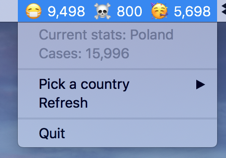

# QuickCovids

Simple COVID-19 live-ish* stat tracker for your MacOS menu bar



<sup>* *Polls data every 30 minutes*</sup>

## Installation

Download (*todo*)

Or, using Go:

```
go get github.com/flexicon/quickcovids
go install github.com/flexicon/quickcovids
```

Simple usage:

```
quickcovids
```

Or if you want to just let it run in the background:

```
nohup quickcovids &>/dev/null &
```

## Credits

Data sourced from: https://disease.sh/

Built with:

- Go
- https://github.com/getlantern/systray
